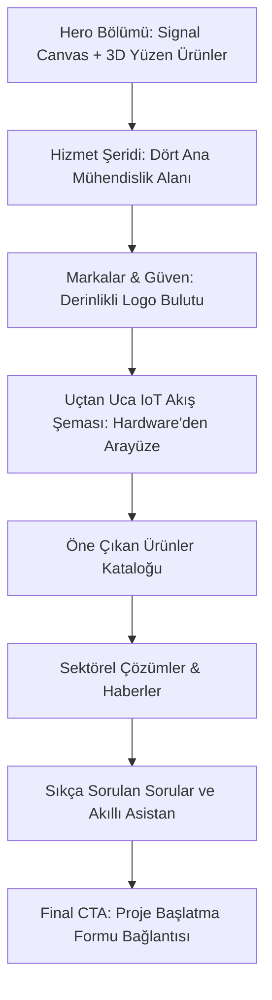

# WillowSoft Web Site Design Documentation (DESIGN.md)

Bu döküman, WillowSoft web sitesinin tasarım sistemini, görsel dilini, renk ve tipografi standartlarını, animasyon prensiplerini ve sayfa yapısını (başta **Ana Sayfa** olmak üzere) teknik ayrıntılarıyla tanımlamaktadır.

---

## 1. Tasarım Felsefesi ve Görsel Tema

WillowSoft, endüstriyel sınıf IoT donanım ve yazılım ekosistemleri geliştiren yüksek teknolojili bir mühendislik firmasıdır. Tasarım dili bu doğrultuda **"Premium Güvenilirlik"** ve **"Teknolojik Modernizm"** felsefesini yansıtır.

* **Koyu ve Açık Denge**: Derin lacivert (`--deep`) ana kurumsal renk olarak profesyonelliği temsil ederken, açık arka planlar (`--surface`) ve cam efektli paneller (glassmorphism) modern bir ferahlık sağlar.
* **Akıcı Geometrik Şekiller**: Yumuşak köşeli kartlar (`--radius: 8px` veya `14px`) ve net kılavuz çizgileri endüstriyel disiplini ifade eder.
* **Sayfa Kişilikleri (Page Personalities)**: Sitenin ana hatları lacivert marka bağıyla tutarlı kalırken, her sayfanın kendine has odak alanını temsil eden bir vurgu rengi (accent color) bulunur.

---

## 2. Tasarım Sistemi Token'ları (CSS Variables)

Aşağıdaki CSS değişkenleri sitenin temel yapı taşlarını oluşturur ve `globals.css` içerisinde `:root` altında tanımlanmıştır.

### Renk Paleti

| Değişken | Renk Değeri | Kullanım Alanı |
| :--- | :--- | :--- |
| `--ink` | `#131b2e` | Ana gövde metin rengi |
| `--muted` | `#454651` | Yardımcı metinler, alt başlıklar |
| `--line` | `#c6c5d3` | İnce çerçeveler, bölücüler |
| `--panel` | `#ffffff` | Kart ve dashboard arka planları |
| `--soft` | `#eaedff` | Hafif renkli blok arka planları |
| `--surface` | `#faf8ff` | Genel sayfa arka planı |
| `--deep` / `--blue` | `#132175` | Marka ana rengi (Primary Navy) |
| `--cyan` | `#1aa3c4` | Temiz teknoloji vurguları, IoT |
| `--green` | `#5ba65b` | Çözümler, çevresel sensörler |
| `--amber` | `#d79a2b` | Hizmetler, akıllı donanım vurguları |
| `--warm` | `#c97f5f` | Şirket tarihi, kurumsal blog |
| `--danger` | `#cf4f45` | Hata ve silme durumları |

> [!NOTE]
> Marka ana lacivert rengi (`--deep`) marka tutarlılığı açısından tüm buton birincil aksiyonlarında (Primary CTA) sabit kalırken, vurgu renkleri (`--accent`) sayfa özelinde dinamik olarak değişir.

### Sayfa Bazlı Vurgu Değişimleri (Page Personalities)

Sitenin `body[data-page]` niteliğine göre vurgu rengi otomatik olarak ezilir (override edilir):

```css
/* Ana Sayfa ve Ürünler */
body[data-page="home"], body[data-page="products"] {
  --accent: var(--cyan);
  --accent-text: #0e687e;
  --accent-soft: rgba(26, 163, 196, 0.10);
  --accent-glow: rgba(26, 163, 196, 0.22);
  --accent-rgb: 26, 163, 196;
}

/* Çözümler ve İletişim */
body[data-page="solutions"], body[data-page="contact"] {
  --accent: var(--green);
  --accent-text: #2b6d2e;
  --accent-soft: rgba(91, 166, 91, 0.10);
  --accent-rgb: 91, 166, 91;
}

/* Hizmetler ve Başvuru */
body[data-page="services"], body[data-page="start-project"] {
  --accent: var(--amber);
  --accent-text: #a06b0d;
  --accent-soft: rgba(215, 154, 43, 0.10);
  --accent-rgb: 215, 154, 43;
}
```

---

## 3. Tipografi Standartları

WillowSoft web sitesinde kontrastı güçlü, modern ve teknik okunurluğu yüksek 3 temel yazı tipi ailesi bir arada kullanılır.

| Yazı Tipi Ailesi | Kullanım Amacı | Tasarım Karakteri |
| :--- | :--- | :--- |
| **Hanken Grotesk** (`--font-display`) | Sayfa başlıkları (`h1`, `h2`, `h3`) | Net, geometrik, okunaklı ve otoriter |
| **Inter** (`--font-body`) | Gövde metinleri, açıklamalar, formlar | Nötr, uzun okumalarda gözü yormayan |
| **Instrument Serif** (`--font-serif`) | Vurgulu eğik sözcükler (*serif-accent*) | Zarif, organik ve insan odaklı bir dokunuş |

### Tipografi Örneği:
> "From *bare metal* to **dashboard** — without fragmented vendors."
> *(Buradaki "bare metal" Instrument Serif italik, "dashboard" Hanken Grotesk bold olarak render edilir).*

---

## 4. Ana Sayfa (Home Page) Tasarım Mimarisi

Ana Sayfa, WillowSoft ekosisteminin tüm katmanlarını bütünleşik bir akışta sunar.



### Detaylı Bölüm Analizleri

#### A. Hero (Giriş) Bölümü
* **Signal Canvas Arka Planı**: Sayfanın arkasında düşük güç dalgalarını sembolize eden interaktif bir dalga simülasyonu çalışır (`data-color="75, 87, 170"`).
* **Müşteri Kanıt Şeridi (Proof Stats)**: 100+ ürün, mutlu müşteriler ve global ofis sayıları dikey kılavuz çizgileriyle bölünmüş temiz bir metrik şeridinde listelenir.
* **3D Yüzen Donanımlar (Aside Stage)**: Sağ tarafta WillowBee modülü, WillowAir sensörü ve WillowMod dönüştürücüsü özel gecikmeli gölge animasyonlarıyla (`--delay`) yerçekimsiz ortam hissi verecek şekilde havada süzülür.

#### B. Hizmet Şeridi (Service Rail)
* Yan yana sıralanmış, numaralandırılmış (`01`, `02`, `03`, `04`) dört minimalist kolon halinde Gömülü Sistemler, Platform, Arayüzler ve Simülasyon başlıklarını içeren, hover durumunda vurgu rengi çerçevesi alan kartlar.

#### C. Logo Bulutu (Trust Showcase)
* **3D Derinlik Efekti**: Müşteri logoları (Honeywell, SLB, Beko vb.) statik bir görsel şerit yerine, fare hareketine veya CSS derinliğine (`--z` ekseni) göre derinlik kazandırılmış pürüzsüz kartlar içinde sergilenir.

#### D. Uçtan Uca Donanım-Yazılım Akış Şeması (Ecosystem)
* Donanımdan kullanıcı arayüzüne kadar olan 5 aşamalı veri akışını gösterir. Koyu renkli (`--deep`) bir arka plan üzerinde yeşil sinyal çizgileriyle desteklenen dikey veya yatay akış şeması:
  1. **Hardware (Donanım)**: Özel PCB ve sensör tasarımları.
  2. **Firmware (Gömülü Yazılım)**: RTOS ve düşük güç tüketim kodları.
  3. **Connectivity (Bağlantı)**: LoRaWAN, Wi-Fi, BLE optimizasyonu.
  4. **Backend (Sunucu/Veritabanı)**: PostgreSQL ve API'ler.
  5. **Interfaces (Arayüzler)**: Web, Mobil ve VR panelleri.

---

## 5. Önemli Arayüz Bileşenleri (Reusable Components)

### 1. Ürün Kartları (`ProductCard.astro`)
* **Saf Beyaz Görsel Alanı**: Görüntülerin (PNG/JPG) arka plan uyumsuzluğu yaşamaması için görsel konteyneri (`figure`) tamamen saf beyaz (`#ffffff !important`) olarak izole edilmiştir.
* **Görsel Geçiş Efekti**: Fare ile üzerine gelindiğinde ürün donanımı hafifçe yukarı doğru hareket eder (`translateY(-8px) scale(1.045)`).

### 2. Sıkça Sorulan Sorular (`FaqAccordion.astro`)
* **Akıllı Yanıt Bloku Entegrasyonu**: AI tabanlı arama asistanı cevaplarını içeren özel cevap kutuları ve pürüzsüz açılıp kapanan (smooth height slide) akordeon satırları.

### 3. CRM Detay Çekmecesi (`LeadDetailsDrawer.tsx`)
* Admin paneline entegre edilmiş, pürüzsüz sağdan kayma (slide-over) animasyonlu CRM yönetim çekmecesi.
* İçerisinde **Detaylar**, **İç Notlar & Dosyalar** ve **Aktivite Geçmişi** sekmelerini barındırır.

---

## 6. Animasyon ve Etkileşim Prensipleri

Sitedeki animasyonlar kullanıcı deneyimini kesintiye uğratmadan akıcılık hissini artırmayı amaçlar:

* **Sweep Sweep (Işık Süpürme) Efekti**: Kartların köşelerinde veya arka planlarında belirli aralıklarla geçen hafif, parıldayan bir ışık çizgisi (`cardLightSweep`).
* **Hover Dönüşümleri**: Etkileşimli kartlar üzerine gelindiğinde hafifçe yükselir (`translateY(-5px)` veya `-6px`), gölgesi derinleşir ve sınır çizgileri vurgu rengine bürünür.
* **Canvas Simülasyonu**: Arka plandaki kılavuz çizgileri, fare hareketlerine duyarlı şekilde hafif dalgalanmalar göstererek sitenin canlı ve tepkisel hissettirmesini sağlar.
